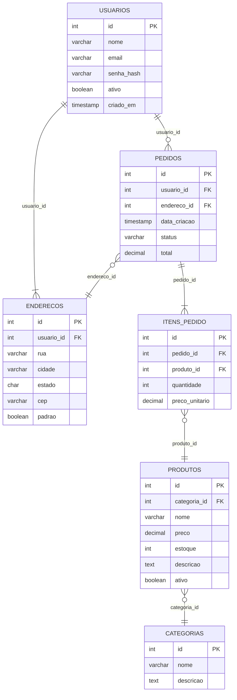

# 🗂️ Diagrama Entidade-Relacionamento (DER)

## O que é?

O **DER (Diagrama Entidade-Relacionamento Lógico)** é a evolução do Modelo ER Conceitual. Enquanto o ER foca no domínio do negócio, o DER foca na **estrutura que vai virar banco de dados**: cada entidade vira uma tabela, os atributos viram colunas, e os relacionamentos viram **chaves estrangeiras (FK)**.

> Em outras palavras: o DER é o "passo do meio" entre o conceito e o SQL.

---

## Diferenças entre ER Conceitual e DER

| Aspecto | ER Conceitual | DER (Lógico) |
|---|---|---|
| Foco | Domínio do negócio | Estrutura de dados |
| Entidades | Abstratas | Viram tabelas com colunas |
| Chave primária | Indicada como "identificador" | PK marcada explicitamente |
| Chave estrangeira | Implícita no relacionamento | FK marcada explicitamente como coluna |
| Tipos de dado | Não obrigatório | Deve aparecer (int, varchar, etc.) |
| Cardinalidade | 1, N, M | Explícita dos dois lados |

---

## Identificando PKs e FKs

### Chave Primária (PK)
- Identifica **unicamente** cada linha da tabela
- Geralmente um campo `id` do tipo inteiro auto-incrementado
- Representada como **PK** ou sublinhada no diagrama

### Chave Estrangeira (FK)
- Uma coluna que **referencia a PK de outra tabela**
- Garante integridade referencial (não dá pra referenciar um ID que não existe)
- Representada como **FK** no diagrama
- Nomeia convenção: `nome_da_tabela_referenciada_id` (ex: `usuario_id`, `produto_id`)

### Como os relacionamentos viram FKs?

| Tipo de relacionamento | Onde fica a FK? |
|---|---|
| 1 para N | Na tabela do lado **N** (o "muitos") |
| 1 para 1 | Em qualquer um dos lados (geralmente o lado dependente) |
| N para M | Cria uma **tabela intermediária** com FK para ambos |

> 📌 No nosso ShopEasy, `ITEM_PEDIDO` é a tabela intermediária que resolve o relacionamento N:M entre `PEDIDO` e `PRODUTO`.

---

## Exemplo: DER do ShopEasy

---

## Coerência com o Diagrama de Classes

Um dos critérios do barema é que o DER seja **coerente com o Diagrama de Classes** (seção 3.2.3). Veja como mapear:

| Diagrama de Classes | DER |
|---|---|
| Classe `Usuario` | Tabela `USUARIOS` |
| Atributo `email: String` | Coluna `email VARCHAR(255)` |
| Composição `Pedido *-- ItemPedido` | FK `pedido_id` em `ITENS_PEDIDO` |
| Associação `Usuario --> Pedido` | FK `usuario_id` em `PEDIDOS` |
| Herança `Administrador --|> Usuario` | Ou tabela própria com FK para USUARIOS, ou coluna `tipo` em USUARIOS |

> ⚠️ **Atenção à herança:** No banco de dados, herança pode ser implementada de 3 formas: tabela única (com coluna discriminadora), tabelas separadas com FK, ou tabela por classe concreta. Escolha uma e seja consistente!

---

## Tabela de Relacionamentos do ShopEasy

| Tabela Filho | FK | Tabela Pai | Cardinalidade |
|---|---|---|---|
| ENDERECOS | usuario_id | USUARIOS | N:1 |
| PRODUTOS | categoria_id | CATEGORIAS | N:1 |
| PEDIDOS | usuario_id | USUARIOS | N:1 |
| PEDIDOS | endereco_id | ENDERECOS | N:1 |
| ITENS_PEDIDO | pedido_id | PEDIDOS | N:1 |
| ITENS_PEDIDO | produto_id | PRODUTOS | N:1 |

---

## Checklist antes de entregar

- [ ] Toda tabela tem uma PK identificada?
- [ ] Todas as FKs estão marcadas explicitamente?
- [ ] As cardinalidades estão nos **dois lados** de cada relação?
- [ ] O DER é coerente com o Diagrama de Classes (mesmas entidades, mesmos relacionamentos)?
- [ ] Relacionamentos N:M foram resolvidos com tabela intermediária?
- [ ] Os tipos de dados fazem sentido (int para IDs, varchar para textos, decimal para preços)?
