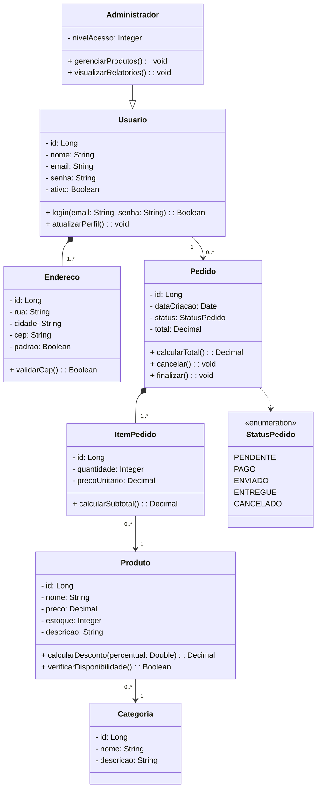

# 📐 Diagrama de Classes do Domínio

## O que é?

O **Diagrama de Classes** é um diagrama UML que representa a estrutura estática do sistema: quais entidades (classes) existem, quais atributos e métodos cada uma tem, e como elas se relacionam entre si.

Ele é o "esqueleto conceitual" do seu sistema, que deve ser feito antes mesmo de pensar em banco de dados ou código.

---

## Anatomia de uma Classe UML

Cada classe é representada por um retângulo dividido em **3 compartimentos obrigatórios**:

```
┌─────────────────────┐
│      NomeDaClasse   │  ← compartimento 1: nome (negrito, centralizado)
├─────────────────────┤
│ - atributo: Tipo    │  ← compartimento 2: atributos
│ # atributo: Tipo    │
├─────────────────────┤
│ + metodo(): Retorno │  ← compartimento 3: métodos
│ + metodo(p: Tipo)   │
└─────────────────────┘
```

### Visibilidade dos membros

| Símbolo | Significado |
|---|---|
| `+` | public — acessível por qualquer classe |
| `-` | private — acessível apenas pela própria classe |
| `#` | protected — acessível pela classe e suas subclasses |

---

## Tipos de Relacionamento

### 1. Associação Simples (`—`)
Uma classe **conhece** a outra. Linha sólida sem adornos especiais.

> Exemplo: `Pedido` conhece `Usuario` (um pedido pertence a um usuário).

### 2. Agregação (`◇—`) — losango **vazio**
Relacionamento "todo-parte" onde a parte **pode existir independentemente** do todo.

> Exemplo: `Carrinho` agrega `Produto`. Se o carrinho for deletado, os produtos continuam existindo.

### 3. Composição (`◆—`) — losango **cheio**
Relacionamento "todo-parte" onde a parte **não existe sem o todo**. Se o todo é destruído, a parte também é.

> Exemplo: `Pedido` compõe `ItemPedido`. Se o pedido for deletado, seus itens não fazem sentido sozinhos.

### 4. Herança / Generalização (`△—`) — triângulo **vazio**
Uma classe **é um tipo de** outra (relação "é-um").

> Exemplo: `Administrador` herda de `Usuario`. Um Administrador é um tipo especial de Usuário.

### 5. Dependência (`- - ->`) — seta tracejada
Uma classe **usa temporariamente** outra (geralmente como parâmetro de método).

---

## Multiplicidades

As multiplicidades ficam nas **duas pontas** de cada associação e indicam quantas instâncias participam do relacionamento.

| Notação | Significado |
|---|---|
| `1` | exatamente um |
| `0..1` | zero ou um (opcional) |
| `*` ou `0..*` | zero ou muitos |
| `1..*` | um ou muitos |
| `2..5` | entre dois e cinco |

> ⚠️ **Erro comum:** Esquecer de colocar multiplicidade nos **dois lados** da associação. Se você colocar só em um lado, o diagrama está incompleto.

---

## Exemplo Completo: ShopEasy



---

## Como ler o diagrama acima

- `Administrador --|> Usuario` → herança: Administrador **é um** Usuario
- `Pedido *-- "1..*" ItemPedido` → composição: um Pedido tem **um ou mais** itens; itens não existem sem o pedido (losango cheio fica no lado do "todo")
- `Usuario "1" --> "0..*" Pedido` → associação: um usuário pode ter zero ou muitos pedidos
- `Usuario *-- "1..*" Endereco` → composição: endereços pertencem ao usuário (losango cheio no Usuario)

---

## Checklist antes de entregar

- [ ] Todos os atributos têm tipo definido?
- [ ] Todos os métodos têm visibilidade (`+`, `-`, `#`)?
- [ ] Multiplicidades nas **duas pontas** de cada associação?
- [ ] Está diferenciando composição (◆) de agregação (◇)?
- [ ] Herança usa o triângulo vazio (não seta comum)?
- [ ] Os nomes fazem sentido para quem vai implementar?
- [ ] O diagrama representa as **Regras de Negócio** do projeto?
