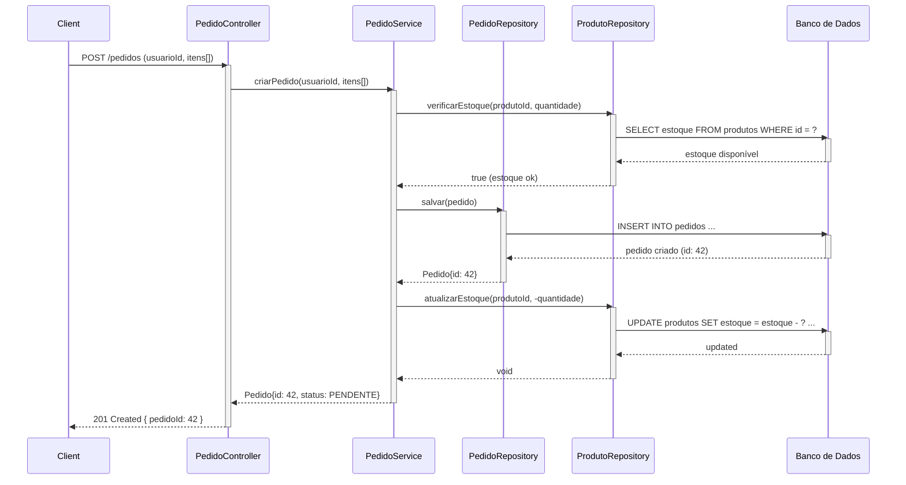
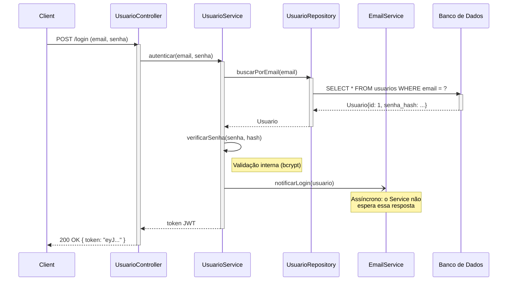
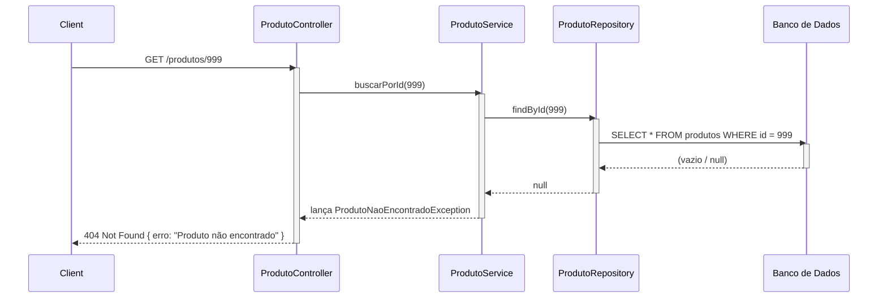

# 🔄 Diagrama de Sequência UML

## O que é?

O **Diagrama de Sequência** mostra a **ordem das interações** entre os componentes do sistema ao longo do tempo. Diferente do Diagrama de Classes (que mostra estrutura), o de Sequência mostra **comportamento**: quem chama quem, em qual ordem, e o que retorna.

Na arquitetura em camadas que vocês usam, o fluxo padrão é:

```
Client → Controller → Service → Repository → Banco de Dados
                                             ↙
                       ← ← ← ← ← ← ← ← ← ←
```

---

## Elementos do Diagrama de Sequência

### Lifelines (linhas de vida)
Cada participante é representado por uma caixa no topo com uma linha vertical tracejada descendo. Representam objetos ou componentes que participam da interação.

### Mensagens
Setas horizontais entre as lifelines. Existem dois tipos principais:

| Tipo | Representação | Quando usar |
|---|---|---|
| **Síncrona** | `——>` seta sólida com ponta cheia | Chamada que espera resposta antes de continuar |
| **Assíncrona** | `——>` seta sólida com ponta aberta | Chamada que não bloqueia (ex: envio de e-mail, fila) |
| **Retorno** | `- - ->` seta tracejada | Resposta de volta para quem chamou |

### Activation Boxes (barras de ativação)
Retângulos finos sobre a lifeline que indicam quando aquele componente está "ativo" (processando).

---

## Arquitetura Controller → Service → Repository

Entenda o papel de cada camada:

| Camada | Responsabilidade |
|---|---|
| **Controller** | Recebe a requisição HTTP, valida entrada básica, chama o Service |
| **Service** | Contém a **lógica de negócio**. Orquestra operações, valida regras de negócio |
| **Repository** | Faz a comunicação com o banco de dados (queries SQL / ORM) |
| **Banco de Dados** | Armazena e retorna os dados |

> 💡 O Controller **não** deve ter lógica de negócio. O Repository **não** deve ter regras de negócio. Cada camada tem seu papel!

---

## Exemplo 1: Criar um Pedido (fluxo síncrono)



---

## Exemplo 2: Login de Usuário com envio de e-mail assíncrono



> 🔑 **Diferença visual:** A seta `-)` indica mensagem **assíncrona** (ponta aberta). Ela foi enviada, mas o fluxo continua sem esperar retorno.

---

## Exemplo 3: Buscar produto por ID (fluxo com erro)



---

## Checklist antes de entregar

- [ ] Cada participante tem sua lifeline (linha de vida)?
- [ ] As mensagens síncronas usam seta sólida com ponta cheia?
- [ ] As mensagens assíncronas usam seta com ponta aberta?
- [ ] Os **retornos** usam linha tracejada?
- [ ] As barras de ativação indicam quando cada componente está ativo?
- [ ] O fluxo segue a ordem: Controller → Service → Repository → Banco?
