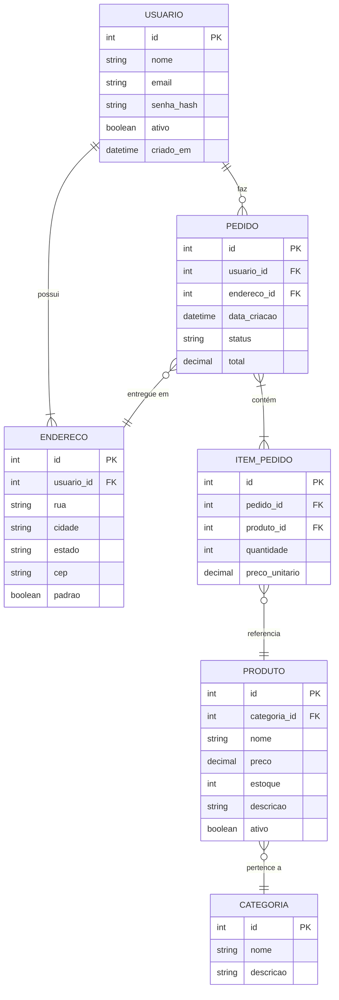

# 🗃️ Modelo Entidade-Relacionamento (ER) Conceitual

## O que é?

O **Modelo ER Conceitual** representa o domínio do problema de forma abstrata, sem se preocupar ainda com tabelas, PKs ou SQL. É o primeiro passo da modelagem de dados, focado em **"o que existe"** no negócio.

Nele você identifica:
- **Entidades:** as "coisas" do domínio (ex: Usuário, Produto, Pedido)
- **Atributos:** as propriedades de cada entidade (ex: nome, preço, data)
- **Relacionamentos:** como as entidades se conectam (ex: Usuário *faz* Pedido)

---

## Diferença entre ER Conceitual, DER (Lógico) e Modelo Físico

| Nível | Nome | Foco | Contém |
|---|---|---|---|
| Conceitual | **Modelo ER** | O domínio do negócio | Entidades, atributos, relacionamentos, cardinalidades |
| Lógico | **DER** | Estrutura de dados | Tabelas, colunas, PKs, FKs |
| Físico | **SQL/Migration** | Implementação real | CREATE TABLE, constraints, índices |

> 💡 Pense assim: o ER é o "rascunho conceitual", o DER é a "planta arquitetônica", e o SQL é a "obra construída".

---

## Notações Disponíveis

Vocês podem escolher **uma** das duas notações — o importante é ser **consistente** (não misturar as duas no mesmo diagrama!).

### Notação de Chen

Criada por Peter Chen em 1976. Usa formas geométricas distintas:

| Forma | Representa |
|---|---|
| Retângulo | Entidade |
| Elipse | Atributo |
| Elipse sublinhada | Atributo identificador (chave) |
| Elipse dupla | Atributo multivalorado |
| Losango | Relacionamento |
| Linha | Conexão entidade-relacionamento |

As cardinalidades ficam escritas nas linhas (1, N, M).

### Notação Crow's Foot (Pé de Galinha)

Mais usada em ferramentas modernas (como dbdiagram.io, Lucidchart). Mais compacta:

| Símbolo na ponta | Significa |
|---|---|
| `|` (linha reta) | Exatamente 1 |
| `O` (círculo) | Zero (opcional) |
| `<` (pé de galinha) | Muitos |

Combinações comuns:
- `||——||` → um para um obrigatório
- `||——O<` → um obrigatório para zero-ou-muitos
- `O|——||` → zero-ou-um para um obrigatório

---

## Exemplo: ShopEasy em Crow's Foot (Mermaid)



---

## Exemplo: ShopEasy em notação Chen (descritivo)

Como o Mermaid não suporta Chen nativo, aqui está uma descrição textual fiel à notação:

```
[USUARIO] ——(faz)——< [PEDIDO]
    |                     |
  <atributos>          <atributos>
  _id_                 _id_
  nome                 data_criacao
  email                status
  senha_hash           total

[USUARIO] ——(possui)——< [ENDERECO]

[PEDIDO] ——(contém)——< [ITEM_PEDIDO] ——(referencia)—— [PRODUTO]

[PRODUTO] ——(pertence_a)—— [CATEGORIA]
```

Legenda:
- `[X]` = Entidade (retângulo)
- `(X)` = Relacionamento (losango)
- `_id_` = Atributo chave (sublinhado)
- `<` = lado "muitos"

---

## Cardinalidades no ER Conceitual

As cardinalidades expressam as **restrições do negócio**:

| Relacionamento | Cardinalidade | Regra de Negócio |
|---|---|---|
| Usuario → Pedido | 1 para N | Um usuário pode ter vários pedidos |
| Pedido → ItemPedido | 1 para N (mínimo 1) | Um pedido precisa de ao menos 1 item |
| ItemPedido → Produto | N para 1 | Vários itens podem referenciar o mesmo produto |
| Produto → Categoria | N para 1 | Vários produtos pertencem a uma categoria |
| Usuario → Endereco | 1 para N (mínimo 1) | Um usuário tem ao menos 1 endereço |

---

## Checklist antes de entregar

- [ ] Escolheu **uma** notação (Chen OU Crow's Foot) e manteve do início ao fim?
- [ ] Todas as entidades do domínio estão representadas?
- [ ] Todos os atributos relevantes estão listados?
- [ ] Os relacionamentos têm nomes descritivos (verbos)?
- [ ] As cardinalidades estão em **ambos os lados** de cada relacionamento?
- [ ] O modelo é fiel às Regras de Negócio definidas?
